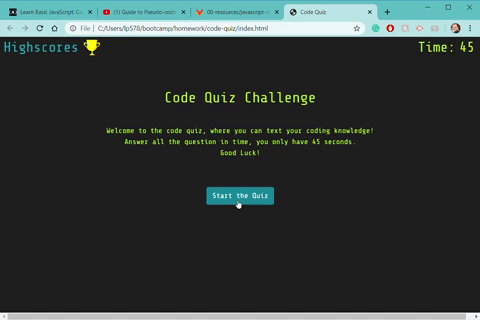

### code-quiz

Coding trivia web-game.

## Functionality 

# Start
Click "Start the Quiz" to start the game.
You will have 45 seconds to answer 5 questions.
Every time you answer, "Correct!" or "Wrong!" message is displayed.

After you answer all the questions or time runs out, your final score will be displayed.

A form to record your name will be displayed.

# Highscores

After you submit your score, you are taken to the Highscores page (which is also accessible form the home page). 

Here all the scores are displayed.
You can click "Go Back" button to return to the beginning of the game.
You can also click "Clear the score" to erase all scores.

## Link to the Code-Quiz:

https://lp5786766.github.io/code-quiz/

## Credits:
-[Luba Pecheneva](https://github.com/lp5786766)
